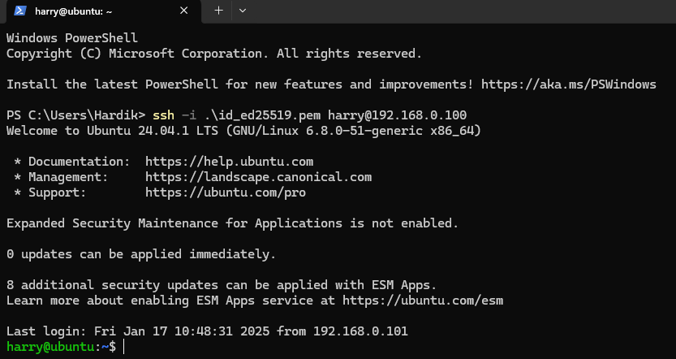

# Connecting Windows PowerShell to Ubuntu Terminal Using SSH in a Home/Local Network 🖥️🔐🌐

Are you looking to connect your Windows machine to your Ubuntu system using SSH over a local network? 🚀 This step-by-step guide will walk you through the process of setting up your Ubuntu system to accept SSH connections, configuring your home router for static IP assignment, and connecting your Windows machine to your Ubuntu terminal using PowerShell. 💡

## Setup on Ubuntu PC 💻🔧

### 1. Update & Install OpenSSH Server 🔄
Open your terminal and run the following commands to update your package list and install the OpenSSH server:
```bash
sudo apt update
sudo apt install openssh-server
```

### 2. Start and Enable the SSH Service 🔓
Ensure the SSH service is up and running:
```bash
sudo systemctl start ssh
sudo systemctl enable ssh
sudo systemctl status ssh
```

### 3. Allow SSH Through the Firewall 🔥
If you're using ufw (Uncomplicated Firewall), you need to allow SSH traffic:
```bash
sudo ufw allow ssh
sudo systemctl status ufw
```

### 4. Install Vim for Key Management 📝
You'll need an editor to manage your SSH keys:
```bash
sudo apt install vim
```

### 5. Generate SSH Keypair 🔑
Generate an SSH key pair using the following command and follow the prompts:
```bash
ssh-keygen
```

Navigate to your `.ssh` directory to view the generated keys:
```bash
cd .ssh
ls
```

Now, copy your private key and save it in a `.pem` file for use on your Windows machine. You can view the private and public keys with:
```bash
cat id_ed25519
cat id_ed25519.pub
```

### 6. Add the Public Key to Your `authorized_keys` File ✔️
Open the `authorized_keys` file and paste your public key (`id_ed25519.pub`) to allow Windows to authenticate via SSH:
```bash
vim authorized_keys
```

## Setup on Home Router (TP-Link Example) 🌍🔌

### 1. Log into Router Settings 🔑
Open a web browser and go to `192.168.0.1` (or the router’s IP address). Use your credentials to log in.

### 2. Assign Static IPs 🌐
Navigate to **DHCP > Address Reservation** and assign static IPs to both your Ubuntu and Windows systems:
- **Ubuntu PC:**
  - MAC Address: `40:8D:5C:51:8E:70`
  - IP Address: `192.168.0.100`
  - Status: Enabled
- **Windows PC:**
  - MAC Address: `F8:FE:5E:81:68:AC`
  - IP Address: `192.168.0.101`
  - Status: Enabled

### 3. Configure Port Forwarding 🔀
Go to **Forwarding** and add a new rule to allow SSH traffic:
- Service Port: `22`
- IP Address: `192.168.0.100`
- Internal Port: `22`
- Protocol: `TCP`

## Setup on Windows PC 💻🖱️

### 1. Save the Private Key 💾
On your Windows machine, create a `.pem` file in your `C:/Users/username` directory and paste the copied private key here.

### 2. Set Permissions for the Key 🔒
Open PowerShell and run the following command to set the correct file permissions:
```powershell
icacls ".\Your_private_key_name.pem" /inheritance:r /grant:r Your_Username":R"
```

Example:
```powershell
icacls ".\connect-ubuntu.pem" /inheritance:r /grant:r Hardik:R
```

### 3. SSH into Ubuntu from PowerShell ⚡
You can now SSH into your Ubuntu machine by running the following command in PowerShell:
```powershell
ssh -i .\Your_private_key_name.pem ubuntu_username@IPv4_address
```

Example:
```powershell
ssh -i .\connect-ubuntu.pem harry@192.168.0.100
```

## Example Output 📸

Here’s what the output looks like after successfully connecting:



## Conclusion 🎉🚀
Once you’ve completed these steps, your Windows PowerShell should successfully connect to your Ubuntu terminal using SSH over your home/local network. This setup provides a secure, seamless way to manage your Ubuntu system directly from your Windows machine. 🔐💻🔧

Happy coding! 🚀💻💡

---

Feel free to drop a comment below if you face any challenges or have questions. 💬🤔
